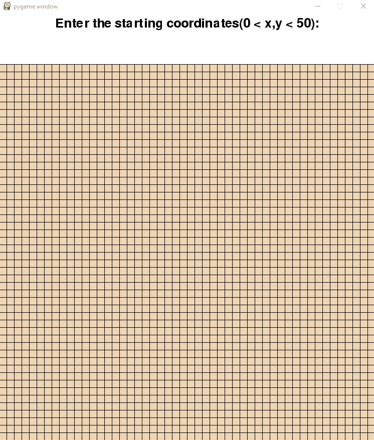

## Pathfinder

### Description:

Pathfinder is a python visualizer program that shows how the shortest path algorithm finds the appropriate route given a starting and ending point in the grid. Users can also draw boundaries on the grid and the algorithm will adapt to it accordingly. In each step, the algorithm looks at four postions from the current position: top, bottom, right and left to find the shortest path. Python Pygame is used to build this application. 

### Demo:

### Credits

Text input module imported from: https://github.com/Nearoo/pygame-text-input
